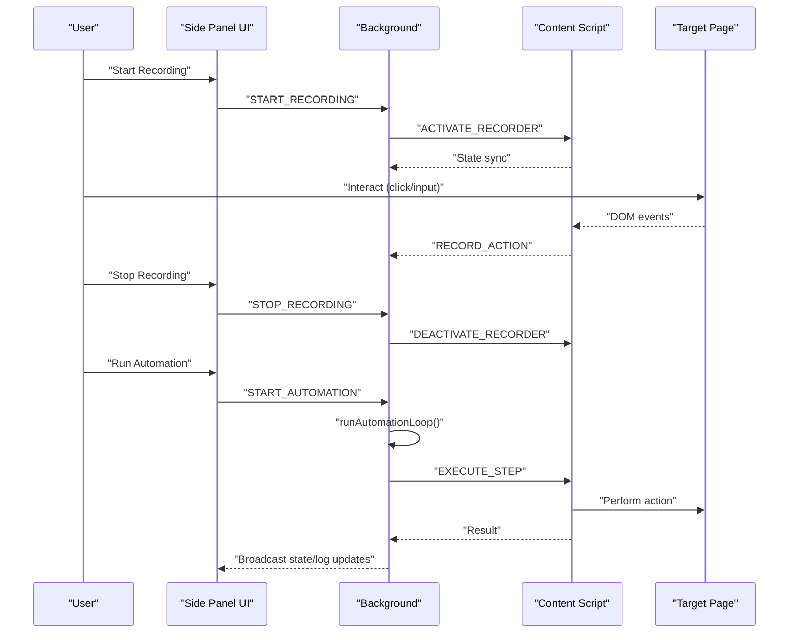
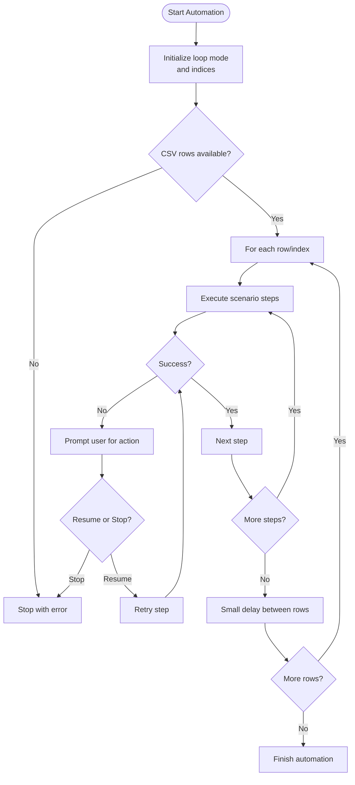
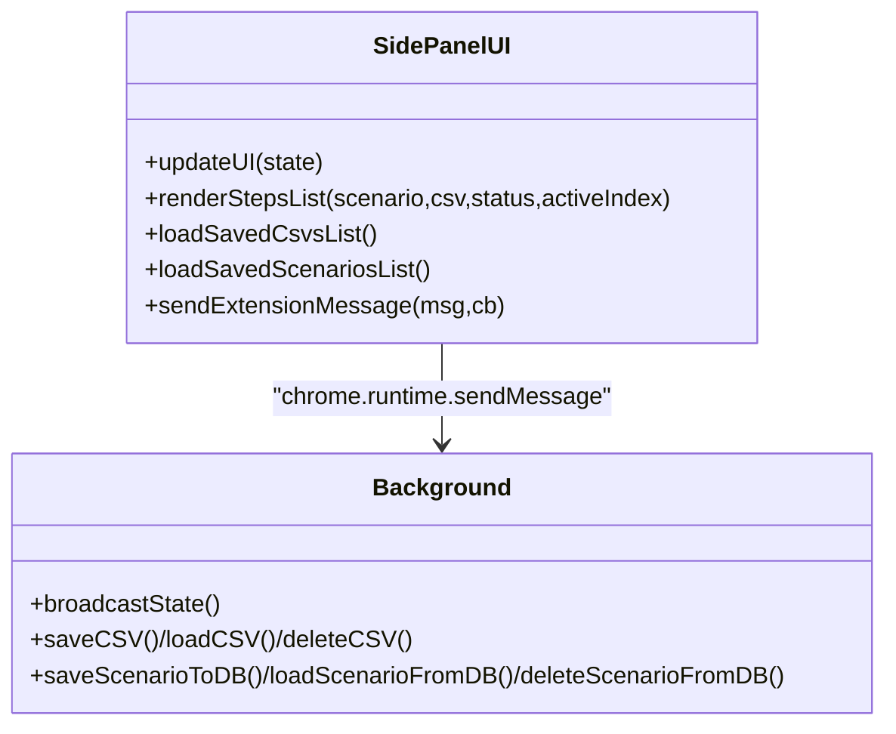
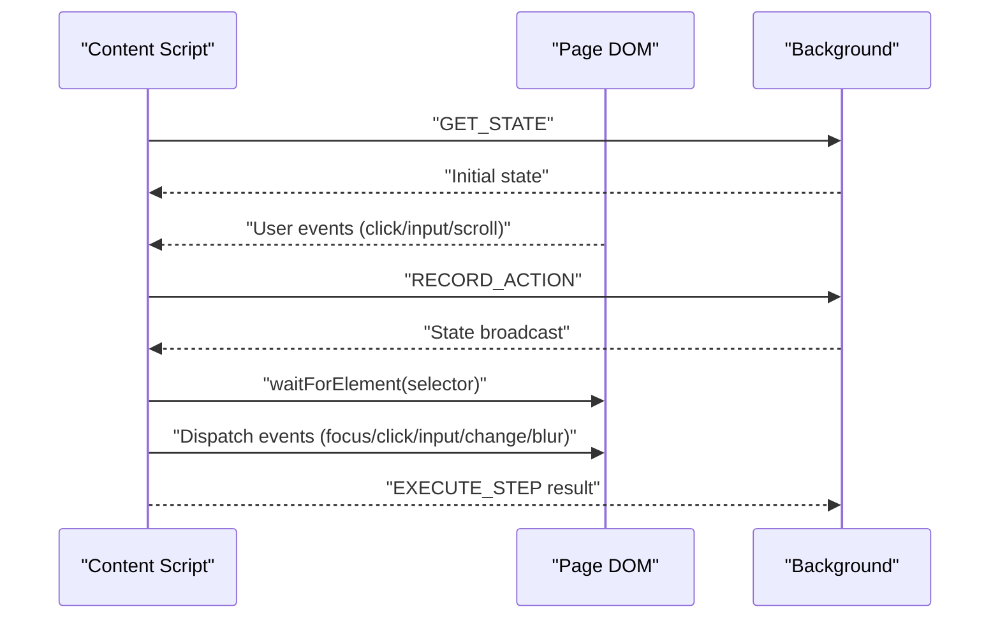
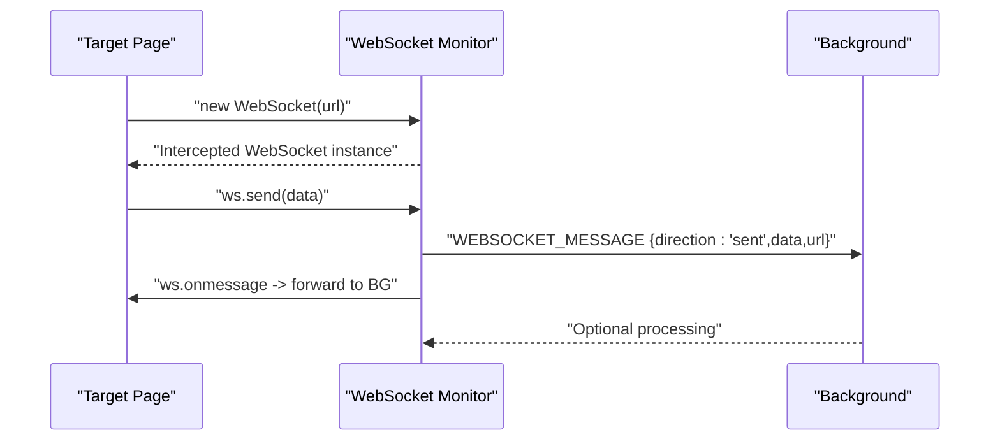
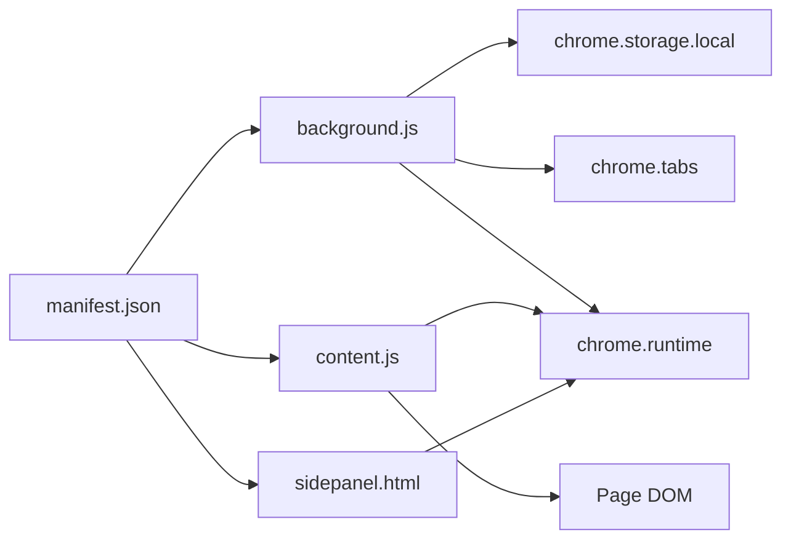

# Architecture Overview

<cite>
**Referenced Files in This Document**
- [manifest.json](file://manifest.json)
- [background.js](file://js/background.js)
- [content.js](file://js/content.js)
- [sidepanel.js](file://js/sidepanel.js)
- [sidepanel.html](file://sidepanel.html)
- [sidepanel.css](file://sidepanel.css)
- [webSocketMonitor.js](file://contoh_ext/js/content/webSocketMonitor.js)
</cite>

## Table of Contents
1. [Introduction](#introduction)
2. [Project Structure](#project-structure)
3. [Core Components](#core-components)
4. [Architecture Overview](#architecture-overview)
5. [Detailed Component Analysis](#detailed-component-analysis)
6. [Dependency Analysis](#dependency-analysis)
7. [Performance Considerations](#performance-considerations)
8. [Troubleshooting Guide](#troubleshooting-guide)
9. [Conclusion](#conclusion)

## Introduction
This document describes the architecture of ExtentionAuto, a Chrome extension implementing a browser automation framework using Manifest V3. The system follows a service-worker-based background architecture with a side panel UI and content scripts that monitor and manipulate target web pages. It demonstrates patterns such as observer-based DOM monitoring and factory-style scenario composition, and supports real-time monitoring hooks for WebSocket traffic.

## Project Structure
The extension is organized around three primary runtime contexts:
- Background service worker: central orchestration, state management, automation engine, and persistence
- Side panel UI: user controls, scenario editing, CSV management, and logging
- Content scripts: DOM interaction, recording, playback, and floating UI injection

```mermaid
graph TB
subgraph "Chrome Extension Runtime"
BG["Background Service Worker<br/>js/background.js"]
SP["Side Panel UI<br/>sidepanel.html + js/sidepanel.js"]
CS["Content Scripts<br/>js/content.js"]
end
subgraph "Target Web Page"
TP["Target Application DOM"]
WS["WebSocket Monitor Hook<br/>contoh_ext/js/content/webSocketMonitor.js"]
end
subgraph "Storage"
LS["chrome.storage.local"]
end
BG <- --> SP
BG <- --> CS
BG --> LS
CS --> TP
CS -. optional hook .-> WS
```

**Diagram sources**
- [manifest.json:16-31](file://manifest.json#L16-L31)
- [background.js:15-40](file://js/background.js#L15-L40)
- [content.js:1-11](file://js/content.js#L1-L11)
- [sidepanel.js:107-113](file://js/sidepanel.js#L107-L113)

**Section sources**
- [manifest.json:1-45](file://manifest.json#L1-L45)
- [background.js:15-40](file://js/background.js#L15-L40)
- [content.js:1-11](file://js/content.js#L1-L11)
- [sidepanel.js:107-113](file://js/sidepanel.js#L107-L113)

## Core Components
- Background Service Worker
  - Central state machine and automation engine
  - Manages recording, playback, CSV and scenario persistence
  - Orchestrates tab navigation and content script messaging
- Side Panel UI
  - User controls for recording, playback, CSV import, and scenario management
  - Real-time status indicators and activity logs
- Content Scripts
  - DOM interaction and recording
  - Playback engine with smart wait using mutation observers
  - Floating UI injection and drag support
- WebSocket Monitor Hook
  - Optional injection to intercept WebSocket messages and forward to background

**Section sources**
- [background.js:15-40](file://js/background.js#L15-L40)
- [sidepanel.js:182-270](file://js/sidepanel.js#L182-L270)
- [content.js:113-181](file://js/content.js#L113-L181)
- [webSocketMonitor.js:1-1](file://contoh_ext/js/content/webSocketMonitor.js#L1-L1)

## Architecture Overview
ExtentionAuto uses a clear separation of concerns:
- Background maintains global state and coordinates automation loops
- Side panel provides a persistent UI for configuration and control
- Content scripts operate within target pages to record and execute actions
- Optional WebSocket monitor augments observability



**Diagram sources**
- [background.js:172-207](file://js/background.js#L172-L207)
- [content.js:77-107](file://js/content.js#L77-L107)
- [sidepanel.js:317-361](file://js/sidepanel.js#L317-L361)

## Detailed Component Analysis

### Background Service Worker
Responsibilities:
- Global state management (recording/playback status, scenario steps, CSV data)
- Automation loop orchestration with pause/resume/error handling
- Tab lifecycle management (find/create tabs, navigation)
- Persistence via chrome.storage.local for CSVs and scenarios
- Broadcasting state to side panel and content script

Key patterns:
- Observer pattern for state broadcasting and UI synchronization
- Factory-style scenario composition via recorded actions
- Error modal coordination with user-driven resume/stop decisions



**Diagram sources**
- [background.js:368-475](file://js/background.js#L368-L475)
- [background.js:529-567](file://js/background.js#L529-L567)

**Section sources**
- [background.js:15-40](file://js/background.js#L15-L40)
- [background.js:341-359](file://js/background.js#L341-L359)
- [background.js:477-527](file://js/background.js#L477-L527)
- [background.js:607-710](file://js/background.js#L607-L710)

### Side Panel UI
Responsibilities:
- Present and edit scenario steps
- Manage CSV datasets and scenario persistence
- Control recording and playback
- Display logs and status indicators
- Handle error modal responses

Implementation highlights:
- Robust message sending with context invalidation checks
- Dynamic rendering of steps with selector/value/csv mapping
- Drag-and-drop CSV upload and preview



**Diagram sources**
- [sidepanel.js:182-270](file://js/sidepanel.js#L182-L270)
- [sidepanel.js:748-806](file://js/sidepanel.js#L748-L806)
- [background.js:607-710](file://js/background.js#L607-L710)

**Section sources**
- [sidepanel.js:107-113](file://js/sidepanel.js#L107-L113)
- [sidepanel.js:182-270](file://js/sidepanel.js#L182-L270)
- [sidepanel.js:623-746](file://js/sidepanel.js#L623-L746)

### Content Scripts
Responsibilities:
- Record user interactions (click, input, scroll)
- Execute actions against the DOM with smart waits
- Inject and manage a floating UI panel
- Communicate with background for state and control

Patterns:
- Observer pattern for DOM monitoring (MutationObserver)
- Factory-style action execution pipeline



**Diagram sources**
- [content.js:7-11](file://js/content.js#L7-L11)
- [content.js:13-75](file://js/content.js#L13-L75)
- [content.js:113-181](file://js/content.js#L113-L181)
- [content.js:183-225](file://js/content.js#L183-L225)

**Section sources**
- [content.js:13-75](file://js/content.js#L13-L75)
- [content.js:113-181](file://js/content.js#L113-L181)
- [content.js:183-225](file://js/content.js#L183-L225)
- [content.js:297-441](file://js/content.js#L297-L441)

### WebSocket Monitor Hook
The optional WebSocket monitor intercepts WebSocket traffic and forwards messages to the background for inspection. It wraps the native WebSocket constructor and listens for send/receive events.



**Diagram sources**
- [webSocketMonitor.js:1-1](file://contoh_ext/js/content/webSocketMonitor.js#L1-L1)

**Section sources**
- [webSocketMonitor.js:1-1](file://contoh_ext/js/content/webSocketMonitor.js#L1-L1)

## Dependency Analysis
Runtime dependencies and relationships:
- Manifest declares permissions and content scripts
- Background depends on chrome.* APIs for tabs, storage, and messaging
- Side panel communicates via chrome.runtime messaging
- Content scripts depend on DOM APIs and chrome.runtime for control



**Diagram sources**
- [manifest.json:6-43](file://manifest.json#L6-L43)
- [background.js:43-53](file://js/background.js#L43-L53)
- [content.js:7-11](file://js/content.js#L7-L11)
- [sidepanel.js:65-93](file://js/sidepanel.js#L65-L93)

**Section sources**
- [manifest.json:6-43](file://manifest.json#L6-L43)
- [background.js:43-53](file://js/background.js#L43-L53)
- [content.js:7-11](file://js/content.js#L7-L11)
- [sidepanel.js:65-93](file://js/sidepanel.js#L65-L93)

## Performance Considerations
- DOM observation: MutationObserver is efficient for real-time DOM changes; avoid excessive deep subtree scans by narrowing selectors
- Messaging overhead: Batch UI updates and throttle frequent broadcasts to reduce churn
- Tab operations: Reuse existing tabs when possible to minimize create/update latency
- CSV processing: Parse and validate CSV in chunks; limit preview sizes in UI
- Error handling: Use pause/resume to avoid tight retry loops that can overload the page

## Troubleshooting Guide
Common issues and resolutions:
- Context invalidated errors: Occur when extension reloads; UI detects and displays a warning; close and reopen side panel or refresh floating UI
- Recording not capturing: Ensure content script is injected and not blocked by page protections; verify floating UI is not intercepting events
- Playback failures: Check element selectors and ensure smart wait conditions; confirm target page allows programmatic interactions
- WebSocket monitoring: Hook requires injection into target frames; ensure appropriate permissions and CSP-compatible injection

**Section sources**
- [sidepanel.js:95-105](file://js/sidepanel.js#L95-L105)
- [content.js:183-225](file://js/content.js#L183-L225)
- [background.js:529-567](file://js/background.js#L529-L567)

## Conclusion
ExtentionAuto employs a clean, Manifest V3-compliant architecture with a robust background controller, a responsive side panel, and capable content scripts. Its use of observer patterns for DOM monitoring and factory-style scenario construction enables flexible automation. Optional WebSocket monitoring enhances observability, while careful attention to messaging and DOM interactions ensures reliable operation across diverse target applications.