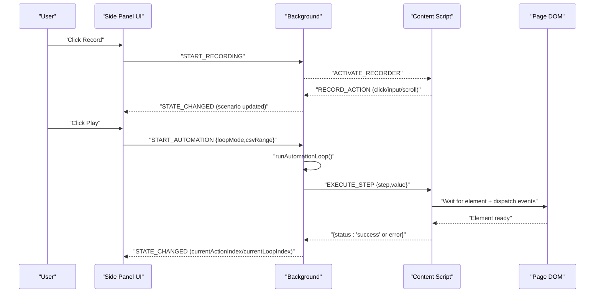
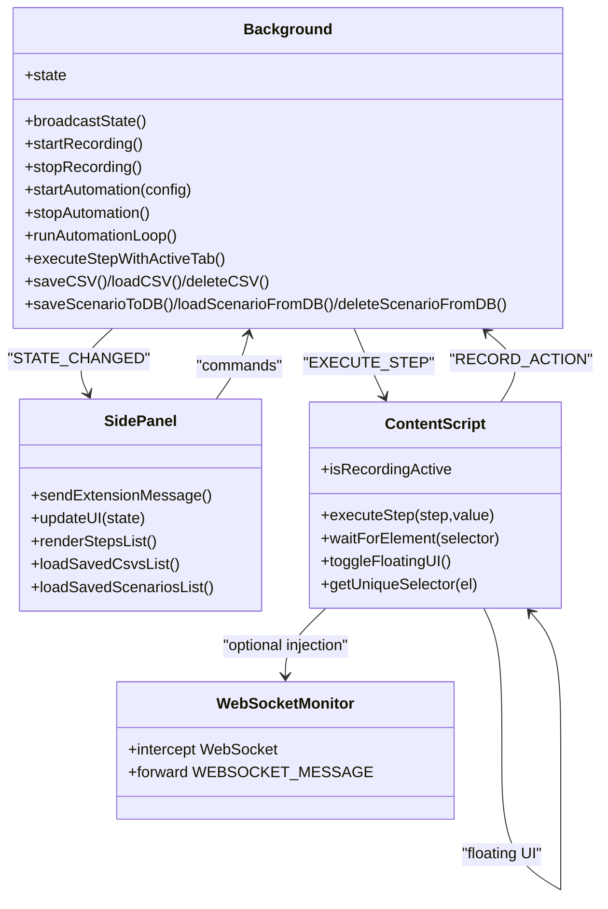
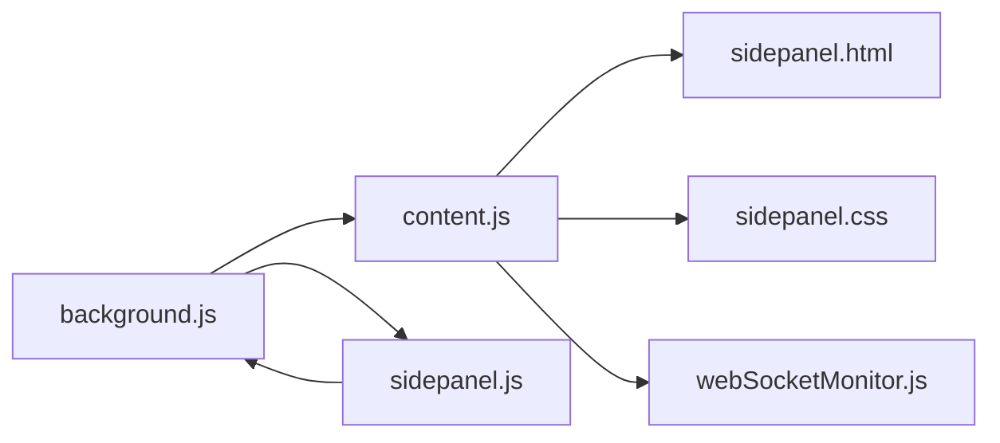

# Core Components

<cite>
**Referenced Files in This Document**
- [manifest.json](file://manifest.json)
- [js/background.js](file://js/background.js)
- [js/content.js](file://js/content.js)
- [js/sidepanel.js](file://js/sidepanel.js)
- [sidepanel.html](file://sidepanel.html)
- [sidepanel.css](file://sidepanel.css)
- [contoh_ext/js/content/webSocketMonitor.js](file://contoh_ext/js/content/webSocketMonitor.js)
- [README.md](file://README.md)
</cite>

## Table of Contents
1. [Introduction](#introduction)
2. [Project Structure](#project-structure)
3. [Core Components](#core-components)
4. [Architecture Overview](#architecture-overview)
5. [Detailed Component Analysis](#detailed-component-analysis)
6. [Dependency Analysis](#dependency-analysis)
7. [Performance Considerations](#performance-considerations)
8. [Troubleshooting Guide](#troubleshooting-guide)
9. [Conclusion](#conclusion)

## Introduction
This document explains ExtentionAuto’s core component system with a focus on:
- Side panel interface architecture and user controls
- Background script functionality for state management and CSV queue processing
- Content script injection mechanisms for DOM manipulation
- WebSocket monitor for real-time interaction coordination
It documents component responsibilities, communication protocols, integration patterns, and provides guidance on performance, error handling, and debugging.

## Project Structure
ExtentionAuto is a Manifest V3 Chrome extension composed of:
- Background service worker for orchestration and state
- Content scripts for DOM recording and playback
- Side panel UI for authoring, automation, and monitoring
- Optional WebSocket monitor for capturing WebSocket traffic

```mermaid
graph TB
subgraph "Browser Runtime"
BG["Background Service Worker<br/>js/background.js"]
CS["Content Scripts<br/>js/content.js"]
SP["Side Panel UI<br/>sidepanel.html + js/sidepanel.js"]
end
subgraph "Web Page"
DOM["Page DOM"]
WS["WebSocket Monitor<br/>contoh_ext/js/content/webSocketMonitor.js"]
end
EXT["Extension Manifest<br/>manifest.json"]
EXT --> BG
EXT --> CS
EXT --> SP
BG <- --> CS
BG <- --> SP
CS --> DOM
WS --> DOM
WS -. optional injection .-> CS
```

**Diagram sources**
- [manifest.json:16-31](file://manifest.json#L16-L31)
- [js/background.js:1-170](file://js/background.js#L1-L170)
- [js/content.js:1-107](file://js/content.js#L1-L107)
- [js/sidepanel.js:1-163](file://js/sidepanel.js#L1-L163)
- [contoh_ext/js/content/webSocketMonitor.js:1-1](file://contoh_ext/js/content/webSocketMonitor.js#L1-L1)

**Section sources**
- [manifest.json:1-45](file://manifest.json#L1-L45)
- [README.md:18-53](file://README.md#L18-L53)

## Core Components
- Background Service Worker (orchestrator)
  - Manages global state, CSV queues, automation loop, error handling, and cross-context messaging
  - Provides APIs for CSV and scenario persistence
- Content Script (recorder/player/floating UI)
  - Records user interactions, executes steps against the DOM, and manages a draggable floating UI overlay
- Side Panel UI (authoring and control)
  - Provides tabs for automation, CSV manager, and scenario storage
  - Sends commands to background and receives state broadcasts
- WebSocket Monitor (optional)
  - Intercepts WebSocket connections to capture sent/received messages and forwards them to the extension runtime

Responsibilities and integration:
- Messaging protocol: chrome.runtime.sendMessage/onMessage between background, content, and side panel
- Shared state: background maintains a single source of truth; side panel and content subscribe to STATE_CHANGED updates
- CSV queue: background coordinates CSV rows across automation loops; content resolves CSV mappings during playback

**Section sources**
- [js/background.js:15-40](file://js/background.js#L15-L40)
- [js/background.js:69-170](file://js/background.js#L69-L170)
- [js/content.js:6-11](file://js/content.js#L6-L11)
- [js/content.js:77-107](file://js/content.js#L77-L107)
- [js/sidepanel.js:107-163](file://js/sidepanel.js#L107-L163)
- [contoh_ext/js/content/webSocketMonitor.js:1-1](file://contoh_ext/js/content/webSocketMonitor.js#L1-L1)

## Architecture Overview
The system follows a unidirectional state broadcast model:
- Background initializes state and emits STATE_CHANGED to side panel and active content script
- Side panel UI sends commands to background (record, play, CSV/scenario ops)
- Content script listens for EXECUTE_STEP and performs DOM actions
- Optional WebSocket monitor injects itself into pages to capture WebSocket traffic



**Diagram sources**
- [js/background.js:172-243](file://js/background.js#L172-L243)
- [js/background.js:341-475](file://js/background.js#L341-L475)
- [js/content.js:77-107](file://js/content.js#L77-L107)
- [js/content.js:113-181](file://js/content.js#L113-L181)

## Detailed Component Analysis

### Background Service Worker
Responsibilities:
- Global state management (status, scenario, CSV data, loop indices, logs)
- Command routing for recording, playback, CSV/scenario operations, and floating UI toggle
- Orchestration of automation loops with pause/resume/error handling
- Broadcasting state to side panel and active content script
- Persistence to chrome.storage.local for CSVs and scenarios

Key APIs and behaviors:
- Message types handled: GET_STATE, START_RECORDING, STOP_RECORDING, RECORD_ACTION, CLEAR_ACTIONS, UPDATE_ACTION, DELETE_ACTION, PLAY_SINGLE_ACTION, START_AUTOMATION, STOP_AUTOMATION, ERROR_MODAL_RESPONSE, TOGGLE_FLOATING, GET_ACTIVE_TAB_INFO, SAVE_CSV, LOAD_CSV, DELETE_CSV, CLOSE_ACTIVE_CSV, SAVE_SCENARIO_TO_DB, LOAD_SCENARIO_FROM_DB, DELETE_SCENARIO_FROM_DB, CLEAR_LOGS
- State broadcasting: broadcastState() notifies side panel and active tab
- Automation engine: runAutomationLoop() iterates CSV rows or static count, pauses on errors, waits for elements, and executes steps
- CSV queue processing: validates ranges, maps CSV columns to step values, and advances loop indices

Parameters and return values:
- Commands return { status: 'success' | 'error', message? } where applicable
- PLAY_SINGLE_ACTION returns execution result
- CSV operations return { status, csv? } or { status, message }
- Scenario operations return { status, scenario? } or { status, message }

Error handling:
- Graceful degradation on disconnected tabs
- Pause/resume prompts via SHOW_ERROR_MODAL and ERROR_MODAL_RESPONSE
- Context invalidated warnings forwarded to UI

Performance considerations:
- Uses MutationObserver and polling for Smart Wait to avoid hard-coded timeouts
- Debounces scroll recording in content script
- Limits log buffer to last 50 entries

**Section sources**
- [js/background.js:15-40](file://js/background.js#L15-L40)
- [js/background.js:69-170](file://js/background.js#L69-L170)
- [js/background.js:232-243](file://js/background.js#L232-L243)
- [js/background.js:341-475](file://js/background.js#L341-L475)
- [js/background.js:607-710](file://js/background.js#L607-L710)

### Side Panel UI
Responsibilities:
- Authoring and editing automation steps
- Managing CSV datasets and scenario storage
- Controlling automation loop mode and ranges
- Displaying logs and status indicators
- Triggering floating UI toggle and single-step execution

Key UI flows:
- Tab switching between Automation, CSV Manager, and Scenarios
- Recording and playback controls with dynamic enable/disable states based on status
- CSV upload via drag-and-drop or file input; parsing and saving to storage
- Scenario save/load/delete operations backed by chrome.storage.local
- Error modal with “Resume” and “Stop” choices

Communication:
- Uses sendExtensionMessage() wrapper around chrome.runtime.sendMessage with error handling
- Subscribes to STATE_CHANGED to update UI and lists
- Emits commands for recording, playback, CSV/scenario ops, and floating UI toggle

**Section sources**
- [js/sidepanel.js:107-163](file://js/sidepanel.js#L107-L163)
- [js/sidepanel.js:317-361](file://js/sidepanel.js#L317-L361)
- [js/sidepanel.js:627-690](file://js/sidepanel.js#L627-L690)
- [js/sidepanel.js:826-844](file://js/sidepanel.js#L826-L844)
- [sidepanel.html:1-255](file://sidepanel.html#L1-L255)
- [sidepanel.css:1-961](file://sidepanel.css#L1-L961)

### Content Script
Responsibilities:
- Record user interactions (click, input, scroll) and forward to background
- Execute steps against the DOM with Smart Wait and event dispatching
- Toggle a floating UI overlay that hosts the side panel inside an iframe
- Inject optional WebSocket monitor into pages

Recording:
- Listens to document-level events (click, blur, scroll) and filters out internal Magerin UI
- Generates unique CSS selectors for recorded actions

Playback:
- Waits for elements using waitForElement() with MutationObserver and polling
- Dispatches realistic events (focus, click, input/change, blur) and smooth scroll animations
- Supports navigate, wait, input, and scroll actions

Floating UI:
- Creates a draggable glassmorphic overlay positioned in the top-right corner
- Embeds sidepanel.html via an iframe with the extension ID

**Section sources**
- [js/content.js:13-76](file://js/content.js#L13-L76)
- [js/content.js:113-181](file://js/content.js#L113-L181)
- [js/content.js:183-225](file://js/content.js#L183-L225)
- [js/content.js:297-398](file://js/content.js#L297-L398)

### WebSocket Monitor (Optional)
Responsibilities:
- Intercept WebSocket constructor to capture send/receive events
- Forward messages to background via chrome.runtime.sendMessage with direction, data, URL, and timestamp
- Handles binary data by decoding ArrayBuffer/Blob

Integration:
- Injected into pages via content script injection (when present)
- Emits WEBSOCKET_MESSAGE events consumed by background or UI

**Section sources**
- [contoh_ext/js/content/webSocketMonitor.js:1-1](file://contoh_ext/js/content/webSocketMonitor.js#L1-L1)

## Architecture Overview



**Diagram sources**
- [js/background.js:15-40](file://js/background.js#L15-L40)
- [js/background.js:69-170](file://js/background.js#L69-L170)
- [js/sidepanel.js:65-93](file://js/sidepanel.js#L65-L93)
- [js/content.js:77-107](file://js/content.js#L77-L107)
- [contoh_ext/js/content/webSocketMonitor.js:1-1](file://contoh_ext/js/content/webSocketMonitor.js#L1-L1)

## Detailed Component Analysis

### Side Panel Interface Architecture
- Tabs: Automation, CSV Manager, Scenarios
- Automation tab: Record, Stop, Clear, Play, loop mode selection, CSV range inputs, manual action entry, steps list with edit/mapping
- CSV Manager: Upload CSV (drag-and-drop), preview headers, list of saved CSVs, open/close
- Scenarios: Save current steps, list of saved scenarios, load/delete
- Status indicators: Dot and text reflecting idle/recording/playing/paused
- Error modal: Resume/Stop with “always apply” option

Communication protocol:
- sendExtensionMessage() wraps chrome.runtime.sendMessage with robust error handling for context invalidation
- Subscribes to STATE_CHANGED to refresh UI and lists

Parameter specifications:
- START_AUTOMATION config includes loopMode, csvStartRow, csvEndRow, staticLoopCount
- CSV operations include name, headers, rows
- Scenario operations include name

Return values:
- Commands return { status, message? } or { status, csv?/scenario? }

**Section sources**
- [js/sidepanel.js:107-163](file://js/sidepanel.js#L107-L163)
- [js/sidepanel.js:317-361](file://js/sidepanel.js#L317-L361)
- [js/sidepanel.js:627-690](file://js/sidepanel.js#L627-L690)
- [js/sidepanel.js:826-844](file://js/sidepanel.js#L826-L844)
- [sidepanel.html:58-227](file://sidepanel.html#L58-L227)

### Background Script: State Management and CSV Queue Processing
State model:
- status: 'idle' | 'recording' | 'playing' | 'paused'
- scenario: array of actions with id, type, selector, value, csvColumn
- csvData: { name, headers[], rows[] }
- loopMode: 'csv' | 'static'
- Indices: currentLoopIndex, currentActionIndex
- activeTabId, errorChoice, isFloatingOpen, logs[]
- Persisted: scenarios, csvs in chrome.storage.local

Queue processing:
- runAutomationLoop() computes start/end based on loopMode and CSV rows
- Iterates rows and actions, broadcasting progress
- Pauses on errors and awaits user choice (resume/stop)
- Executes steps via executeStepWithActiveTab()

Execution pipeline:
- For navigate/wait: direct handling
- For DOM actions: sendMessage to active tab, then waitForElement and dispatch events

**Section sources**
- [js/background.js:15-40](file://js/background.js#L15-L40)
- [js/background.js:341-475](file://js/background.js#L341-L475)
- [js/background.js:477-527](file://js/background.js#L477-L527)

### Content Script: DOM Manipulation and Recording
Recording:
- Captures clicks, input blur events, and scroll events on the main window
- Filters out events originating from Magerin’s floating UI
- Generates unique CSS selectors using getUniqueSelector()

Playback:
- executeStep() handles click, input, scroll
- waitForElement() uses MutationObserver and polling with timeout
- Dispatches realistic events to trigger reactive frameworks

Floating UI:
- toggleFloatingUI() creates/removes a draggable overlay hosting sidepanel.html via iframe
- Uses makeElementDraggable() for drag-and-drop behavior

**Section sources**
- [js/content.js:13-76](file://js/content.js#L13-L76)
- [js/content.js:113-181](file://js/content.js#L113-L181)
- [js/content.js:183-225](file://js/content.js#L183-L225)
- [js/content.js:297-398](file://js/content.js#L297-L398)

### WebSocket Monitor: Real-Time Interaction Coordination
- Intercepts new WebSocket instances
- Hooks send() to emit WEBSOCKET_MESSAGE with direction "sent"
- Adds message listeners to emit WEBSOCKET_MESSAGE with direction "received"
- Handles binary data by decoding ArrayBuffer/Blob to text

Integration:
- Injected by content script when present
- Messages forwarded to background/UI via chrome.runtime.sendMessage

**Section sources**
- [contoh_ext/js/content/webSocketMonitor.js:1-1](file://contoh_ext/js/content/webSocketMonitor.js#L1-L1)

## Dependency Analysis



**Diagram sources**
- [manifest.json:16-31](file://manifest.json#L16-L31)
- [js/background.js:172-243](file://js/background.js#L172-L243)
- [js/content.js:77-107](file://js/content.js#L77-L107)
- [js/sidepanel.js:107-163](file://js/sidepanel.js#L107-L163)
- [sidepanel.html:1-255](file://sidepanel.html#L1-255)
- [sidepanel.css:1-961](file://sidepanel.css#L1-L961)
- [contoh_ext/js/content/webSocketMonitor.js:1-1](file://contoh_ext/js/content/webSocketMonitor.js#L1-L1)

**Section sources**
- [manifest.json:1-45](file://manifest.json#L1-L45)
- [js/background.js:172-243](file://js/background.js#L172-L243)
- [js/content.js:77-107](file://js/content.js#L77-L107)
- [js/sidepanel.js:107-163](file://js/sidepanel.js#L107-L163)

## Performance Considerations
- Smart Wait avoids hard-coded delays by using MutationObserver plus polling; tune timeouts and debounce scroll recording to reduce overhead
- Debounce scroll recording in content script reduces noisy recording volume
- Limit log buffer to 50 entries to control memory usage
- Broadcast state selectively; side panel and content script only update when necessary
- Use minimal DOM traversal and event dispatching to minimize reflows
- Prefer batched updates for CSV mapping UI to avoid frequent re-renders

[No sources needed since this section provides general guidance]

## Troubleshooting Guide
Common issues and remedies:
- Context invalidated errors
  - Symptom: UI warns about extension context invalidated
  - Cause: Extension reload or navigation causing runtime disconnect
  - Remedy: Close and reopen side panel or reload floating UI page
- Tab connectivity failures
  - Symptom: Playback fails with “tab connection lost”
  - Cause: Tab closed or page blocked
  - Remedy: Refresh page and retry; background attempts to recreate tab if needed
- Element not found during playback
  - Symptom: Timeout waiting for selector
  - Cause: Dynamic content not ready
  - Remedy: Adjust Smart Wait expectations; verify selectors; use scroll/wait actions to stabilize DOM
- CSV mapping mismatch
  - Symptom: Wrong data injected into forms
  - Remedy: Verify CSV headers and mapping selections; ensure column names match
- Floating UI not opening
  - Symptom: Toggle does nothing on protected pages (chrome://, Web Store)
  - Remedy: Open on a regular web page; ensure iframe can load sidepanel.html

Debugging tips:
- Inspect logs in side panel log area
- Use browser developer tools to observe chrome.runtime messages and state broadcasts
- Temporarily disable floating UI to isolate content script issues
- Validate CSV parsing by checking headers preview and row counts

**Section sources**
- [js/sidepanel.js:65-93](file://js/sidepanel.js#L65-L93)
- [js/background.js:532-567](file://js/background.js#L532-L567)
- [js/content.js:183-225](file://js/content.js#L183-L225)

## Conclusion
ExtentionAuto’s core components form a cohesive automation platform:
- Background orchestrates state, CSV queues, and playback with robust error handling
- Content script records and executes DOM actions with Smart Wait and floating UI
- Side panel provides authoring, CSV/scenario management, and real-time feedback
- Optional WebSocket monitor captures live WebSocket traffic for advanced coordination

The system emphasizes reliability through state synchronization, resilient DOM waiting, and user-driven error handling, while maintaining a modern, accessible UI.

[No sources needed since this section summarizes without analyzing specific files]