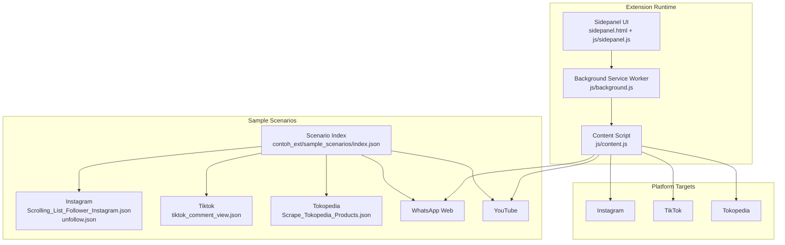
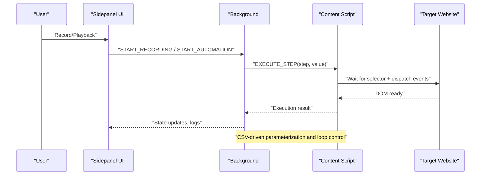
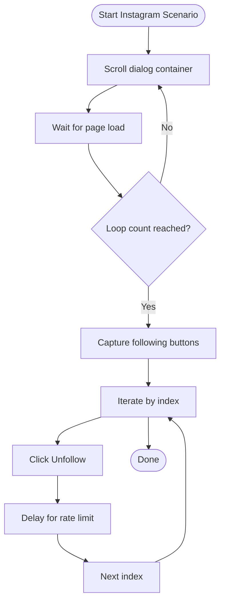
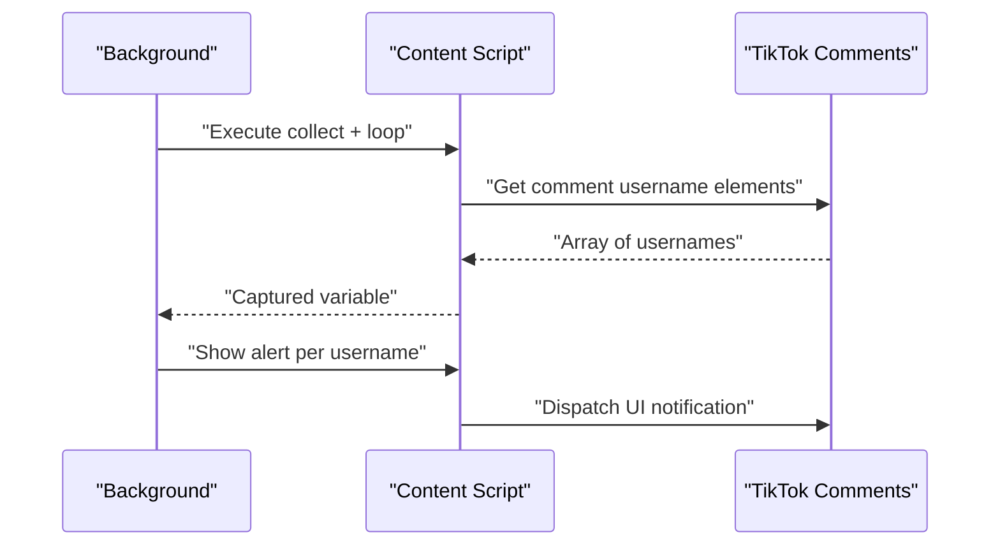
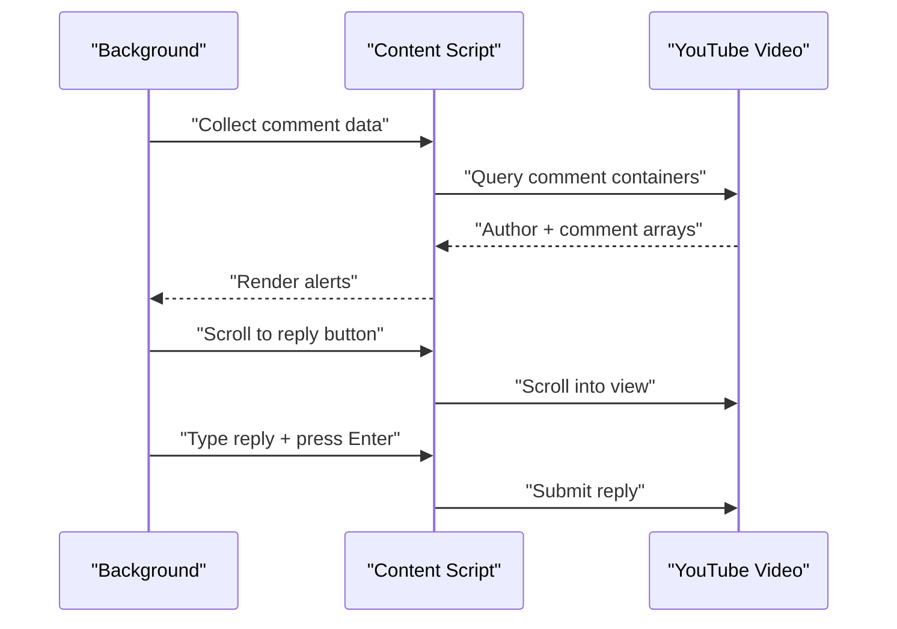
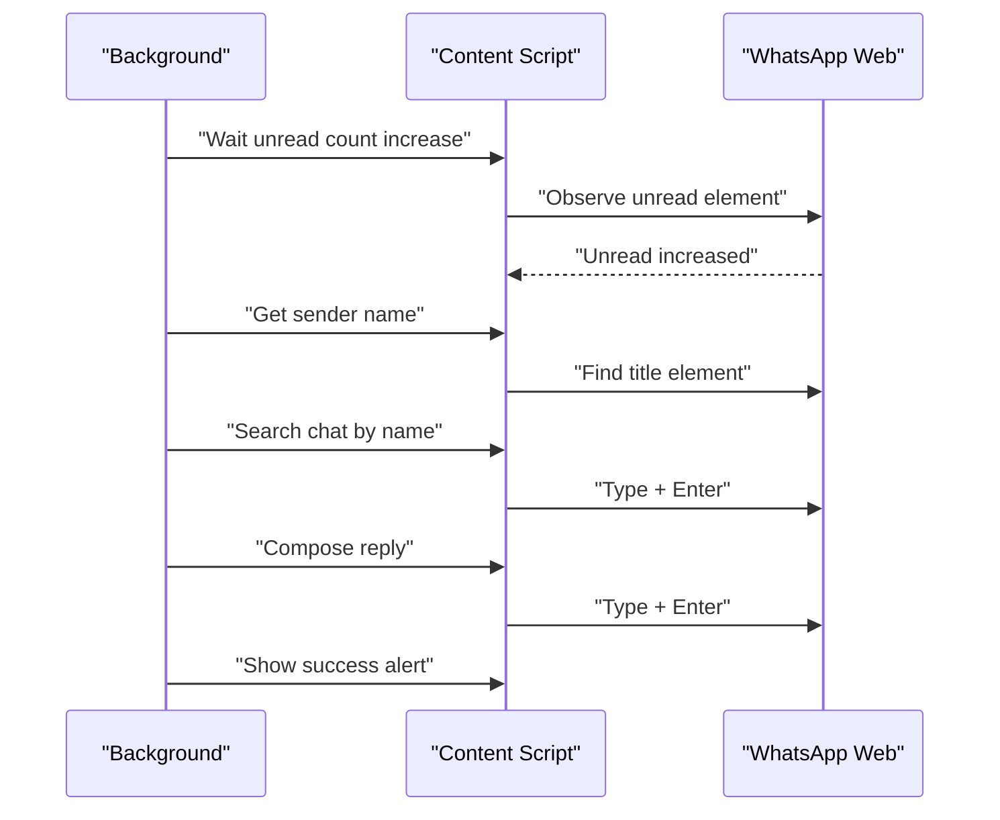
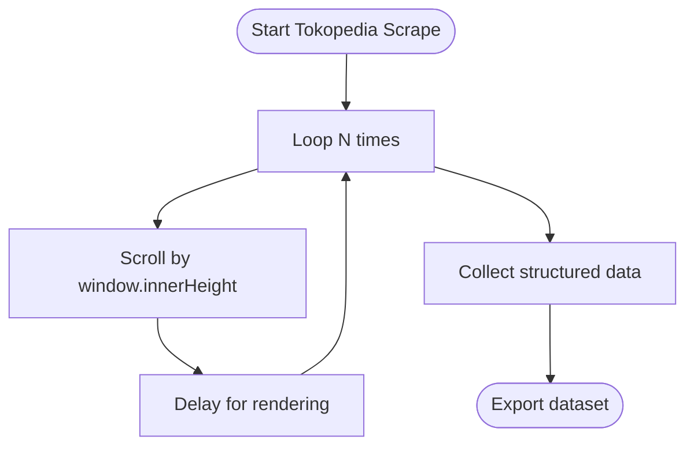
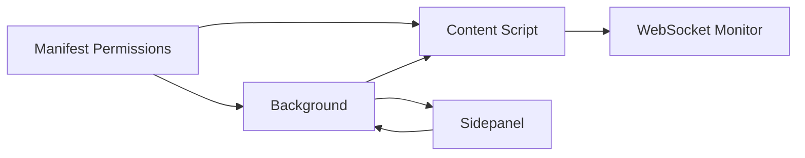

# Platform-Specific Features

<cite>
**Referenced Files in This Document**
- [manifest.json](file://contoh_ext/manifest.json)
- [webSocketMonitor.js](file://contoh_ext/js/content/webSocketMonitor.js)
- [background.js](file://js/background.js)
- [content.js](file://js/content.js)
- [sidepanel.js](file://js/sidepanel.js)
- [sidepanel.html](file://sidepanel.html)
- [sidepanel.css](file://sidepanel.css)
- [index.json](file://contoh_ext/sample_scenarios/index.json)
- [Scrolling_List_Follower_Instagram.json](file://contoh_ext/sample_scenarios/Instagram/Scrolling_List_Follower_Instagram.json)
- [unfollow.json](file://contoh_ext/sample_scenarios/Instagram/unfollow.json)
- [tiktok_comment_view.json](file://contoh_ext/sample_scenarios/Tiktok/tiktok_comment_view.json)
- [Scrape_Tokopedia_Products.json](file://contoh_ext/sample_scenarios/Tokopedia/Scrape_Tokopedia_Products.json)
- [Deteksi_Pesan_Baru_WA.json](file://contoh_ext/sample_scenarios/WhatsApp/Deteksi_Pesan_Baru_WA.json)
- [Alert_Youtube_Comment.json](file://contoh_ext/sample_scenarios/Youtube/Alert_Youtube_Comment.json)
- [Reply_Comment_Youtube.json](file://contoh_ext/sample_scenarios/Youtube/Reply_Comment_Youtube.json)
</cite>

## Table of Contents
1. [Introduction](#introduction)
2. [Project Structure](#project-structure)
3. [Core Components](#core-components)
4. [Architecture Overview](#architecture-overview)
5. [Detailed Component Analysis](#detailed-component-analysis)
6. [Dependency Analysis](#dependency-analysis)
7. [Performance Considerations](#performance-considerations)
8. [Troubleshooting Guide](#troubleshooting-guide)
9. [Conclusion](#conclusion)

## Introduction
This document explains ExtentionAuto’s platform-specific automation features as demonstrated by the included sample scenarios. It focuses on how the extension records, stores, and executes automation flows for:
- Instagram: follower scrolling and unfollow operations
- TikTok: comment viewing and iteration
- YouTube: comment alerts and reply automation
- WhatsApp: new message detection and automated replies
- Tokopedia: product listing scraping

It also documents selectors, interaction patterns, and platform limitations observed from the scenario files, along with practical examples, common use cases, and troubleshooting approaches for anti-bot measures, rate limiting, and dynamic content handling.

## Project Structure
ExtentionAuto consists of:
- A Manifest V3 extension with permissions for activeTab, scripting, storage, sidePanel, and tabs
- A content script that monitors WebSocket traffic and records user interactions
- A background service worker orchestrating automation loops, CSV integration, and state synchronization
- A sidepanel UI for recording, editing, and executing automation scenarios
- Sample scenarios organized by platform under contoh_ext/sample_scenarios

**Diagram sources**
- [manifest.json:1-44](file://contoh_ext/manifest.json#L1-L44)
- [background.js:1-711](file://js/background.js#L1-L711)
- [content.js:1-442](file://js/content.js#L1-L442)
- [sidepanel.js:1-924](file://js/sidepanel.js#L1-L924)
- [index.json:1-162](file://contoh_ext/sample_scenarios/index.json#L1-L162)

**Section sources**
- [manifest.json:1-44](file://contoh_ext/manifest.json#L1-L44)
- [index.json:1-162](file://contoh_ext/sample_scenarios/index.json#L1-L162)

## Core Components
- Background orchestration: manages state, CSV data, automation loops, and error handling
- Content script: executes recorded actions, dispatches DOM events, and waits for elements
- Sidepanel UI: records actions, edits selectors/values, runs single-step tests, and controls loops
- WebSocket monitoring: intercepts WebSocket messages for visibility into real-time communication

Key capabilities:
- Record clicks, inputs, scrolls, waits, and navigation
- Playback with CSV-driven parameterization
- Loop constructs and variable capture for platform-specific flows
- Error modal with resume/stop choices and “always apply” persistence

**Section sources**
- [background.js:15-711](file://js/background.js#L15-L711)
- [content.js:113-225](file://js/content.js#L113-L225)
- [sidepanel.js:317-437](file://js/sidepanel.js#L317-L437)
- [webSocketMonitor.js:1-1](file://contoh_ext/js/content/webSocketMonitor.js#L1-L1)

## Architecture Overview
The extension uses a three-tier architecture:
- UI tier: sidepanel for authoring and playback
- Control tier: background orchestrates scenarios, CSV, and error handling
- Execution tier: content script performs DOM actions and waits for dynamic content

**Diagram sources**
- [background.js:342-527](file://js/background.js#L342-L527)
- [content.js:113-181](file://js/content.js#L113-L181)
- [sidepanel.js:348-361](file://js/sidepanel.js#L348-L361)

## Detailed Component Analysis

### Instagram Automation
Instagram scenarios demonstrate:
- Scrolling a modal dialog to load more followers
- Capturing a collection of following buttons and iterating to unfollow
- Using loop constructs and variable capture for dynamic counts

Selectors and interaction patterns:
- Scroll within a dialog role container to trigger lazy loading
- Capture a collection of matching elements and iterate by index
- Click “Unfollow” after resolving the index

Common use cases:
- Bulk unfollow inactive accounts
- Populate a dataset of followers for downstream processing

Platform limitations:
- Dynamic content requires explicit waits and scroll triggers
- Selector stability depends on platform attributes (role, class variants)
- Rate limiting and anti-bot measures may throttle rapid interactions

Practical example paths:
- [Scrolling_List_Follower_Instagram.json:1-26](file://contoh_ext/sample_scenarios/Instagram/Scrolling_List_Follower_Instagram.json#L1-L26)
- [unfollow.json:1-40](file://contoh_ext/sample_scenarios/Instagram/unfollow.json#L1-L40)

**Diagram sources**
- [Scrolling_List_Follower_Instagram.json:4-24](file://contoh_ext/sample_scenarios/Instagram/Scrolling_List_Follower_Instagram.json#L4-L24)
- [unfollow.json:5-39](file://contoh_ext/sample_scenarios/Instagram/unfollow.json#L5-L39)

**Section sources**
- [Scrolling_List_Follower_Instagram.json:1-26](file://contoh_ext/sample_scenarios/Instagram/Scrolling_List_Follower_Instagram.json#L1-L26)
- [unfollow.json:1-40](file://contoh_ext/sample_scenarios/Instagram/unfollow.json#L1-L40)

### TikTok Comment Viewing and Engagement
TikTok scenario demonstrates:
- Capturing usernames from comment items
- Iterating through captured names and showing alerts
- Intermittent delays between iterations

Selectors and interaction patterns:
- Locate comment item containers and extract usernames
- Use loop index to access array elements
- Show alerts with formatted messages

Common use cases:
- Monitoring mentions or keywords in comments
- Building a watchlist of commenters

Platform limitations:
- Dynamic comment rendering may require waits
- Selector specificity impacts reliability across layouts

Practical example path:
- [tiktok_comment_view.json:1-30](file://contoh_ext/sample_scenarios/Tiktok/tiktok_comment_view.json#L1-L30)

**Diagram sources**
- [tiktok_comment_view.json:5-28](file://contoh_ext/sample_scenarios/Tiktok/tiktok_comment_view.json#L5-L28)

**Section sources**
- [tiktok_comment_view.json:1-30](file://contoh_ext/sample_scenarios/Tiktok/tiktok_comment_view.json#L1-L30)

### YouTube Comment Alert Systems and Reply Automation
YouTube scenarios demonstrate:
- Capturing comment containers and extracting author and comment text
- Iterating through collected data to show alerts
- Scrolling to a reply button and typing a reply

Selectors and interaction patterns:
- Collect comment nodes and nested author/comment text
- Use into-view scroll for interactive elements
- Type into reply input and submit with Enter

Common use cases:
- Monitoring new comments and responding quickly
- Batch alerting for moderation workflows

Platform limitations:
- Reactive UI frameworks may require synthetic input events
- Scroll-to-element and click timing are critical

Practical example paths:
- [Alert_Youtube_Comment.json:1-41](file://contoh_ext/sample_scenarios/Youtube/Alert_Youtube_Comment.json#L1-L41)
- [Reply_Comment_Youtube.json:1-26](file://contoh_ext/sample_scenarios/Youtube/Reply_Comment_Youtube.json#L1-L26)

**Diagram sources**
- [Alert_Youtube_Comment.json:5-39](file://contoh_ext/sample_scenarios/Youtube/Alert_Youtube_Comment.json#L5-L39)
- [Reply_Comment_Youtube.json:5-24](file://contoh_ext/sample_scenarios/Youtube/Reply_Comment_Youtube.json#L5-L24)

**Section sources**
- [Alert_Youtube_Comment.json:1-41](file://contoh_ext/sample_scenarios/Youtube/Alert_Youtube_Comment.json#L1-L41)
- [Reply_Comment_Youtube.json:1-26](file://contoh_ext/sample_scenarios/Youtube/Reply_Comment_Youtube.json#L1-L26)

### WhatsApp Message Detection and Response
WhatsApp scenario demonstrates:
- Waiting for unread count increase on the first chat item
- Extracting the sender’s name
- Typing the recipient name into the search field
- Pressing Enter to open the chat
- Typing a response and sending with Enter
- Showing a success alert

Selectors and interaction patterns:
- Use data-testid attributes for reliable targeting
- Simulate keypress events for Enter submission
- Combine typed values with captured variables

Common use cases:
- Automated acknowledgments for incoming messages
- Routing based on sender identity

Platform limitations:
- Reliance on stable data-testid attributes
- Timing-sensitive interactions may require delays

Practical example path:
- [Deteksi_Pesan_Baru_WA.json:1-51](file://contoh_ext/sample_scenarios/WhatsApp/Deteksi_Pesan_Baru_WA.json#L1-L51)

**Diagram sources**
- [Deteksi_Pesan_Baru_WA.json:4-49](file://contoh_ext/sample_scenarios/WhatsApp/Deteksi_Pesan_Baru_WA.json#L4-L49)

**Section sources**
- [Deteksi_Pesan_Baru_WA.json:1-51](file://contoh_ext/sample_scenarios/WhatsApp/Deteksi_Pesan_Baru_WA.json#L1-L51)

### Tokopedia Product Scraping Operations
Tokopedia scenario demonstrates:
- Iterative scrolling to load more products
- Delay between scrolls to allow content to render
- Collecting structured data (product name, price, sales) after pagination

Selectors and interaction patterns:
- Scroll by window inner height to trigger infinite scroll
- Use collectData with a pipe-delimited spec to extract multiple fields
- Apply delays to stabilize dynamic content

Common use cases:
- Price monitoring and inventory tracking
- Market research and competitive analysis

Platform limitations:
- Dynamic content loading requires careful timing
- Selector specificity affects extraction accuracy

Practical example path:
- [Scrape_Tokopedia_Products.json:1-31](file://contoh_ext/sample_scenarios/Tokopedia/Scrape_Tokopedia_Products.json#L1-L31)

**Diagram sources**
- [Scrape_Tokopedia_Products.json:4-30](file://contoh_ext/sample_scenarios/Tokopedia/Scrape_Tokopedia_Products.json#L4-L30)

**Section sources**
- [Scrape_Tokopedia_Products.json:1-31](file://contoh_ext/sample_scenarios/Tokopedia/Scrape_Tokopedia_Products.json#L1-L31)

## Dependency Analysis
The extension’s runtime components depend on:
- Manifest permissions enabling content scripts and side panel
- Background orchestration coordinating state and messaging
- Content script executing DOM actions and smart waits
- Sidepanel UI driving recording and playback

**Diagram sources**
- [manifest.json:6-12](file://contoh_ext/manifest.json#L6-L12)
- [background.js:1-13](file://js/background.js#L1-L13)
- [content.js:1-11](file://js/content.js#L1-L11)
- [webSocketMonitor.js:1-1](file://contoh_ext/js/content/webSocketMonitor.js#L1-L1)

**Section sources**
- [manifest.json:1-44](file://contoh_ext/manifest.json#L1-L44)
- [background.js:1-711](file://js/background.js#L1-L711)
- [content.js:1-442](file://js/content.js#L1-L442)
- [sidepanel.js:1-924](file://js/sidepanel.js#L1-L924)

## Performance Considerations
- Element waiting: The content script uses MutationObserver and polling to wait for elements, reducing flakiness on dynamic pages
- Scroll behavior: Smooth scrolling with post-scroll waits prevents missed interactions during pagination
- Loop control: CSV-driven loops and static loop counts enable controlled throughput
- Error handling: Pause/resume modal allows operators to decide whether to continue after failures

[No sources needed since this section provides general guidance]

## Troubleshooting Guide
Common issues and remedies:
- Elements not found: Increase timeouts or add explicit waits; verify selectors match current platform attributes
- Anti-bot measures: Introduce randomized delays; avoid excessive rapid clicks; stagger actions
- Dynamic content: Use waitForPageLoad or explicit delays; rely on scroll triggers to load content
- Rate limiting: Reduce loop frequency; implement backoff strategies
- Selector drift: Prefer data-testid or stable aria-label attributes; avoid brittle class chains

Operational tips:
- Use the single-step test button to validate individual actions before full playback
- Inspect logs for precise failure messages and timestamps
- Utilize the floating UI toggle to keep the sidepanel accessible during long sessions

**Section sources**
- [content.js:184-225](file://js/content.js#L184-L225)
- [background.js:532-567](file://js/background.js#L532-L567)
- [sidepanel.js:502-512](file://js/sidepanel.js#L502-L512)

## Conclusion
ExtentionAuto provides a robust framework for platform-specific automation through a unified recording and playback engine. The sample scenarios illustrate practical patterns for Instagram, TikTok, YouTube, WhatsApp, and Tokopedia, highlighting the importance of selectors, dynamic content handling, and operational safeguards against anti-bot measures and rate limits. By leveraging CSV-driven parameterization, loop constructs, and resilient waiting mechanisms, users can build reliable automations tailored to each platform’s UI and behavior.