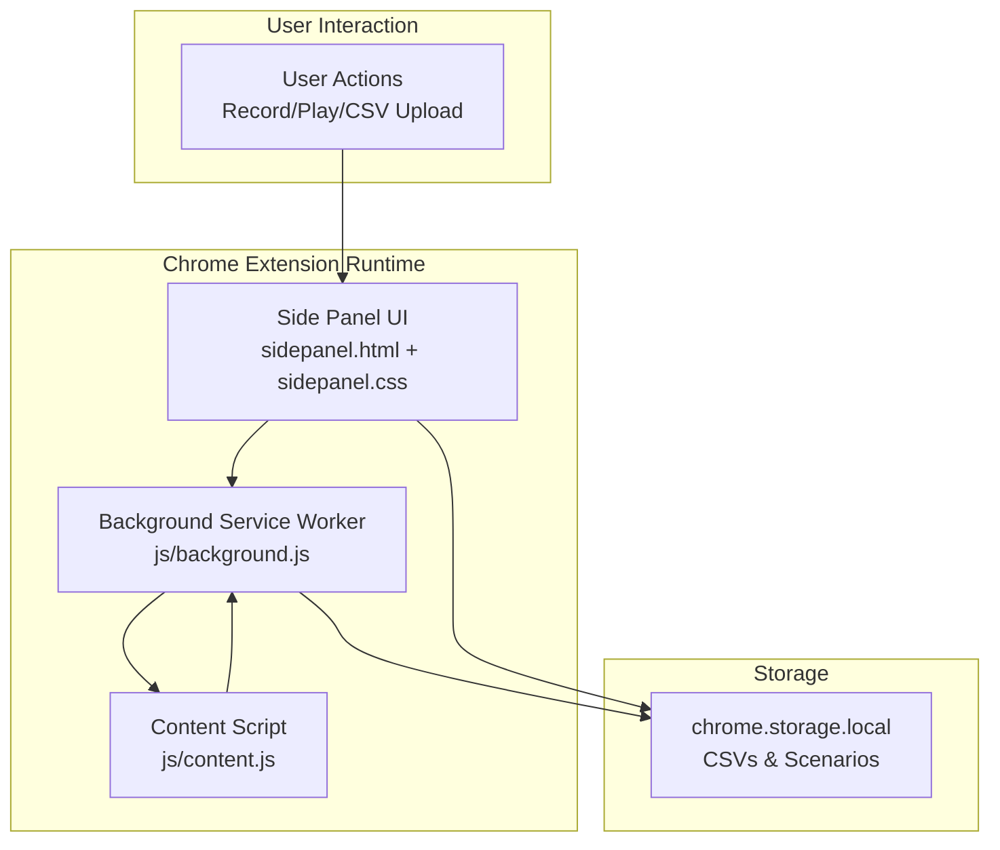
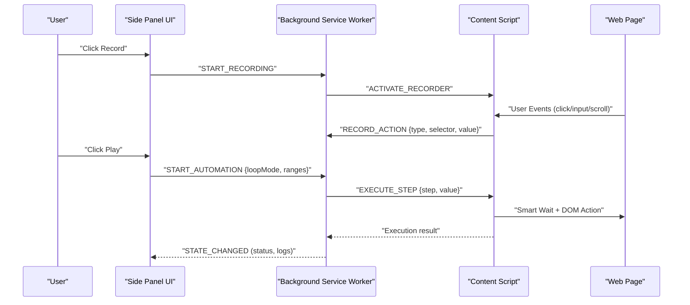
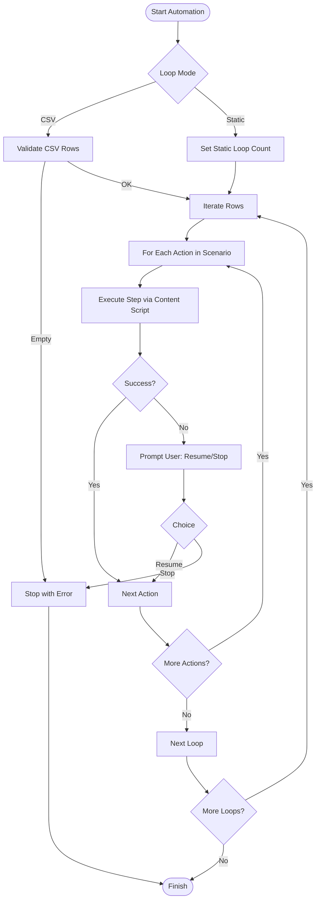
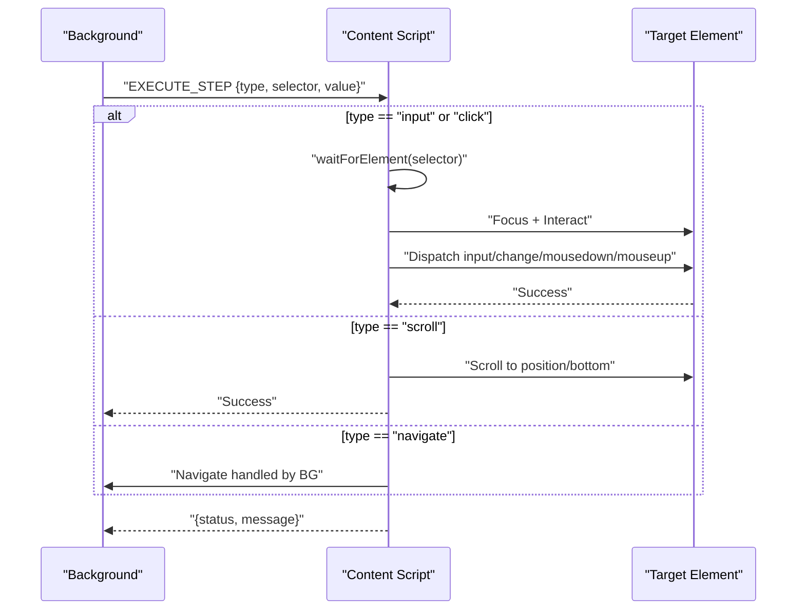
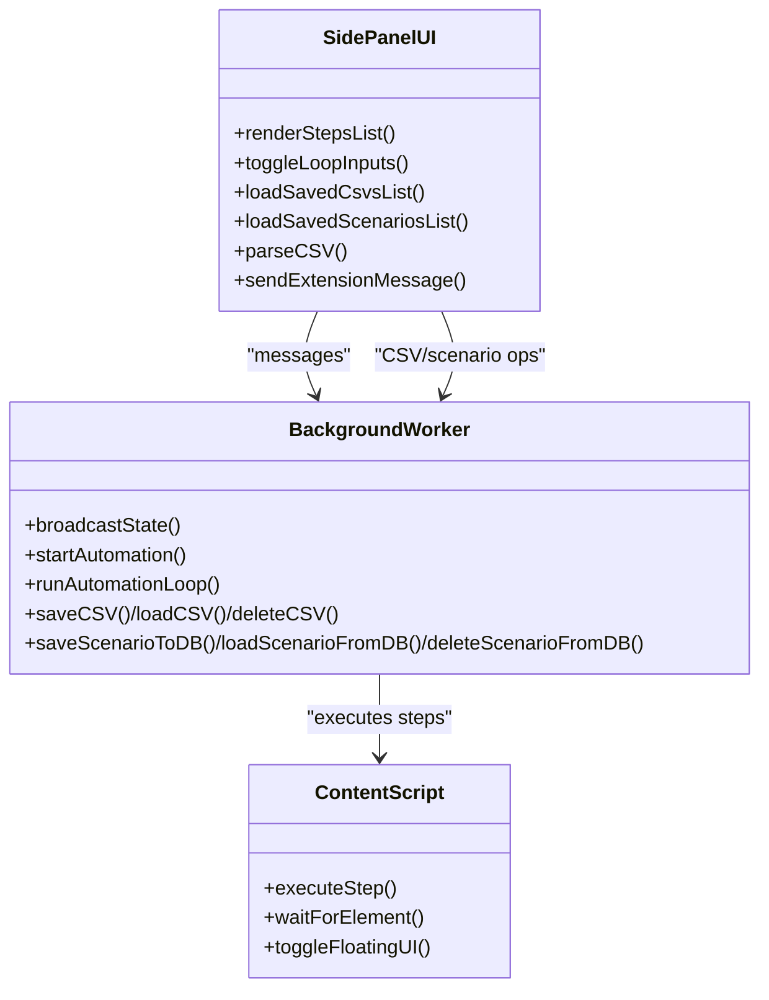
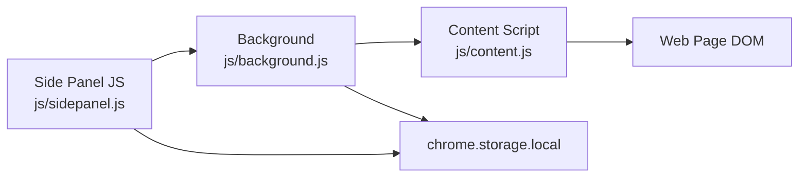

# Project Overview

<cite>
**Referenced Files in This Document**
- [manifest.json](file://manifest.json)
- [README.md](file://README.md)
- [agent.md](file://agent.md)
- [sidepanel.html](file://sidepanel.html)
- [sidepanel.css](file://sidepanel.css)
- [js/background.js](file://js/background.js)
- [js/content.js](file://js/content.js)
- [js/sidepanel.js](file://js/sidepanel.js)
</cite>

## Table of Contents
1. [Introduction](#introduction)
2. [Project Structure](#project-structure)
3. [Core Components](#core-components)
4. [Architecture Overview](#architecture-overview)
5. [Detailed Component Analysis](#detailed-component-analysis)
6. [Dependency Analysis](#dependency-analysis)
7. [Performance Considerations](#performance-considerations)
8. [Troubleshooting Guide](#troubleshooting-guide)
9. [Conclusion](#conclusion)
10. [Appendices](#appendices)

## Introduction
Magerin is a Robotic Process Automation (RPA) browser extension built for Google Chrome (Manifest V3). It enables users to record, manage, and execute cross-page automation scenarios with a modern glassmorphic dark UI. The extension emphasizes intelligent waiting mechanisms (smart wait), dynamic CSV-driven form mapping, and flexible loop controls to support repeatable, data-driven web tasks across diverse platforms.

Key goals:
- Provide a beginner-friendly interface with guided recording and playback
- Deliver robust execution with smart wait to avoid flaky automation
- Enable dynamic CSV upload and mapping for scalable, data-driven workflows
- Support both Side Panel and Floating UI modes for flexible interaction

## Project Structure
At a high level, the project consists of:
- Manifest V3 declaration for permissions, service worker, side panel, and content scripts
- A side panel UI with three primary tabs: Automation, CSV Manager, and Saved Scenarios
- A dark glassmorphic theme with interactive cards, status indicators, and modals
- A background service worker orchestrating state, CSV storage, and automation loops
- A content script capturing user interactions and executing actions with smart wait
- A sidepanel controller coordinating UI state, CSV parsing, and message passing

**Diagram sources**
- [manifest.json:16-31](file://manifest.json#L16-L31)
- [js/background.js:15-40](file://js/background.js#L15-L40)
- [js/content.js:1-120](file://js/content.js#L1-L120)
- [sidepanel.html:12-255](file://sidepanel.html#L12-L255)
- [sidepanel.css:1-120](file://sidepanel.css#L1-L120)

**Section sources**
- [manifest.json:1-45](file://manifest.json#L1-L45)
- [README.md:47-56](file://README.md#L47-L56)

## Core Components
- Manifest V3: Declares permissions, host permissions, service worker, side panel, and content script injection
- Background Service Worker: Central state manager, CSV persistence, automation loop orchestration, and error handling
- Content Script: Recorder and player for clicks, inputs, scrolls, and navigation; implements smart wait and selector generation
- Side Panel UI: Scenario management, CSV upload and mapping, loop configuration, logging, and error modal
- Glassmorphic Dark Theme: Modern dark UI with frosted glass cards, accent gradients, and responsive layout

Practical highlights:
- Scenario Management: Record, edit, delete, and save scenarios; supports granular action editing and manual action insertion
- Dynamic CSV Upload: Drag-and-drop CSV upload, header preview, and per-action CSV mapping for inputs and navigation
- Smart Wait Engine: Waits for elements to appear using MutationObserver and timeouts before executing actions
- Loop Controls: CSV-range loops and static loop counts with pause/resume and per-error user decisions

**Section sources**
- [README.md:18-44](file://README.md#L18-L44)
- [agent.md:31-50](file://agent.md#L31-L50)
- [js/background.js:15-40](file://js/background.js#L15-L40)
- [js/content.js:113-181](file://js/content.js#L113-L181)
- [js/sidepanel.js:440-621](file://js/sidepanel.js#L440-L621)

## Architecture Overview
The extension follows a classic MV3 architecture:
- Background service worker maintains global state and coordinates automation
- Content script runs in-page to capture events and execute DOM actions
- Side panel communicates with the background via message passing and renders UI state
- Storage APIs persist CSVs and scenarios locally

**Diagram sources**
- [js/sidepanel.js:318-361](file://js/sidepanel.js#L318-L361)
- [js/background.js:77-118](file://js/background.js#L77-L118)
- [js/content.js:78-107](file://js/content.js#L78-L107)
- [js/content.js:113-181](file://js/content.js#L113-L181)

## Detailed Component Analysis

### Manifest V3 Declaration
- Permissions: storage, tabs, scripting, sidePanel, activeTab
- Host permissions: <all_urls>
- Service worker: background.js
- Side panel: sidepanel.html
- Content script: injected on all frames for all URLs
- Web-accessible resources: sidepanel assets for cross-origin availability

Compatibility:
- Designed for Chromium-based browsers with Manifest V3 support

**Section sources**
- [manifest.json:6-44](file://manifest.json#L6-L44)

### Background Service Worker
Responsibilities:
- Global state management (status, scenario, CSV data, loop indices)
- Recording lifecycle (start/stop) and action capture forwarding
- CSV CRUD operations using chrome.storage.local
- Automation loop orchestration (CSV range or static count)
- Error handling with user prompts (resume/stop) and persistent choices
- Floating UI toggle and active tab management

Key flows:
- State broadcasting to side panel and content script
- Tab switching and creation for navigation actions
- Per-step execution with retries and timeouts

**Diagram sources**
- [js/background.js:342-475](file://js/background.js#L342-L475)
- [js/background.js:478-527](file://js/background.js#L478-L527)
- [js/background.js:532-567](file://js/background.js#L532-L567)

**Section sources**
- [js/background.js:15-40](file://js/background.js#L15-L40)
- [js/background.js:342-475](file://js/background.js#L342-L475)
- [js/background.js:569-589](file://js/background.js#L569-L589)

### Content Script (Recorder, Player, Floating UI)
Capabilities:
- Recorder: Captures clicks, input changes, and scroll events; generates unique selectors
- Player: Executes actions with smart wait; dispatches proper events for reactive frameworks
- Floating UI: Injects a draggable, glassmorphic iframe overlay on supported pages

Smart wait engine:
- Uses MutationObserver and optional timeouts to detect element presence before interacting

Selector generation:
- Prefers unique identifiers, attributes, classes, and hierarchical selectors

Floating UI:
- Creates a fixed-position iframe container with drag handle and close button

**Diagram sources**
- [js/content.js:96-107](file://js/content.js#L96-L107)
- [js/content.js:113-181](file://js/content.js#L113-L181)
- [js/content.js:184-225](file://js/content.js#L184-L225)
- [js/content.js:301-398](file://js/content.js#L301-L398)

**Section sources**
- [js/content.js:13-107](file://js/content.js#L13-L107)
- [js/content.js:184-225](file://js/content.js#L184-L225)
- [js/content.js:301-398](file://js/content.js#L301-L398)

### Side Panel UI and Logic
Features:
- Tabs: Automation, CSV Manager, Saved Scenarios
- Automation controls: Record, Stop, Clear, Play, Manual Action, Loop Settings
- Steps list: Edit selectors/values, per-action CSV mapping dropdown
- CSV Manager: Upload/drop zone, header preview, saved CSV list
- Saved Scenarios: Save current scenario, list loaded scenarios
- Logging: Real-time activity logs with clear action
- Error modal: Resume/Stop with “always apply” option

Theme and UX:
- Glassmorphic cards, purple/cyan accents, animated status dots, and responsive layout

**Diagram sources**
- [js/sidepanel.js:440-621](file://js/sidepanel.js#L440-L621)
- [js/background.js:608-710](file://js/background.js#L608-L710)
- [js/content.js:96-107](file://js/content.js#L96-L107)

**Section sources**
- [sidepanel.html:59-227](file://sidepanel.html#L59-L227)
- [sidepanel.css:237-485](file://sidepanel.css#L237-L485)
- [js/sidepanel.js:107-163](file://js/sidepanel.js#L107-L163)

### Glassmorphic Dark UI Theme
Design philosophy:
- Deep navy blue base with frosted glass cards and subtle borders
- Accent gradients (purple/cyan) for interactive elements and status indicators
- Responsive layout optimized for side panel and floating window sizes
- Animated status dots and glow effects for enhanced feedback

**Section sources**
- [README.md:7-16](file://README.md#L7-L16)
- [agent.md:5-11](file://agent.md#L5-L11)
- [sidepanel.css:1-24](file://sidepanel.css#L1-L24)
- [sidepanel.css:237-247](file://sidepanel.css#L237-L247)

### Smart Wait Engine Technology
Mechanism:
- Pre-action element discovery using waitForElement with MutationObserver
- Real-time DOM mutation monitoring and optional hard timeout
- Graceful failure reporting back to background for user decision

Benefits:
- Prevents skipping actions on dynamic or slow-loading pages
- Reduces flakiness by ensuring readiness before interaction

**Section sources**
- [agent.md:44-48](file://agent.md#L44-L48)
- [js/content.js:184-225](file://js/content.js#L184-L225)

### Dynamic CSV Mapping Capabilities
Workflow:
- Upload CSV via drag-and-drop or file selection
- Preview headers and rows in UI
- Map per-action input/navigation values to CSV columns
- Execute loops over CSV rows with configurable start/end ranges

Use cases:
- Bulk form filling from datasets
- Iterative scraping with per-row navigation
- Multi-user registration with validation

**Section sources**
- [README.md:26-31](file://README.md#L26-L31)
- [agent.md:21-30](file://agent.md#L21-L30)
- [js/sidepanel.js:627-740](file://js/sidepanel.js#L627-L740)
- [js/background.js:608-654](file://js/background.js#L608-L654)

### Practical Examples Across Web Automation Scenarios
Common scenarios enabled by the extension:
- Form automation: Record input actions, map fields to CSV columns, and run bulk submissions
- Pagination traversal: Combine scroll actions with loop ranges to scrape paginated content
- Platform-specific flows: Social media automation (e.g., following/unfollowing), comment moderation, and analytics extraction
- Validation workflows: Use wait and error modal responses to handle dynamic UI states

These examples demonstrate scenario management, smart wait, and dynamic CSV mapping in action.

**Section sources**
- [README.md:18-44](file://README.md#L18-L44)
- [agent.md:31-50](file://agent.md#L31-L50)

## Dependency Analysis
High-level dependencies:
- Side Panel depends on Background for state and CSV/scenario operations
- Background depends on Content Script for DOM execution and on Storage for persistence
- Content Script depends on DOM readiness and MutationObserver for smart wait

**Diagram sources**
- [js/sidepanel.js:65-93](file://js/sidepanel.js#L65-L93)
- [js/background.js:232-243](file://js/background.js#L232-L243)
- [js/content.js:7-11](file://js/content.js#L7-L11)

**Section sources**
- [js/sidepanel.js:65-93](file://js/sidepanel.js#L65-L93)
- [js/background.js:232-243](file://js/background.js#L232-L243)
- [js/content.js:7-11](file://js/content.js#L7-L11)

## Performance Considerations
- Smart wait avoids busy-wait loops by leveraging MutationObserver and controlled timeouts
- Debounced scroll recording reduces noise during long sessions
- Minimal DOM traversal and targeted selector generation improve reliability
- Floating UI uses a single iframe with drag constraints to minimize overhead

Recommendations:
- Prefer unique selectors to reduce ambiguity and waiting time
- Limit loop ranges to necessary bounds to reduce runtime
- Use “always apply” error handling judiciously to avoid repeated retries

[No sources needed since this section provides general guidance]

## Troubleshooting Guide
Common issues and resolutions:
- Context invalidated warnings: Occur after extension reloads; close and reopen the side panel or refresh the floating UI
- Element not found errors: Trigger smart wait timeouts; adjust selectors or add explicit waits
- Floating UI not opening: Ensure the page is not a protected Chrome URL; retry on a regular web page
- CSV mapping not applied: Verify CSV is loaded and headers match; re-check per-action mapping dropdown

**Section sources**
- [js/sidepanel.js:95-105](file://js/sidepanel.js#L95-L105)
- [js/background.js:532-567](file://js/background.js#L532-L567)
- [js/content.js:301-398](file://js/content.js#L301-L398)

## Conclusion
Magerin delivers a powerful yet accessible RPA solution for Chrome with a modern glassmorphic UI, robust smart wait engine, and dynamic CSV-driven automation. Its MV3 architecture ensures compatibility and performance, while the side panel and floating UI modes offer flexibility for different workflows. By combining intuitive scenario management with advanced loop controls and error handling, Magerin supports both beginners and experienced users in automating repetitive web tasks reliably.

[No sources needed since this section summarizes without analyzing specific files]

## Appendices
- Installation and development setup instructions are provided in the project’s README for local unpacked loading

**Section sources**
- [README.md:56-63](file://README.md#L56-L63)