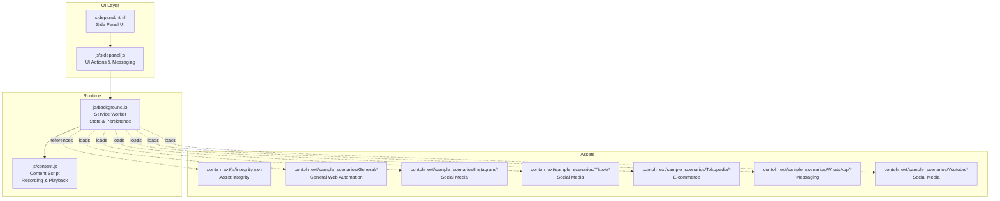
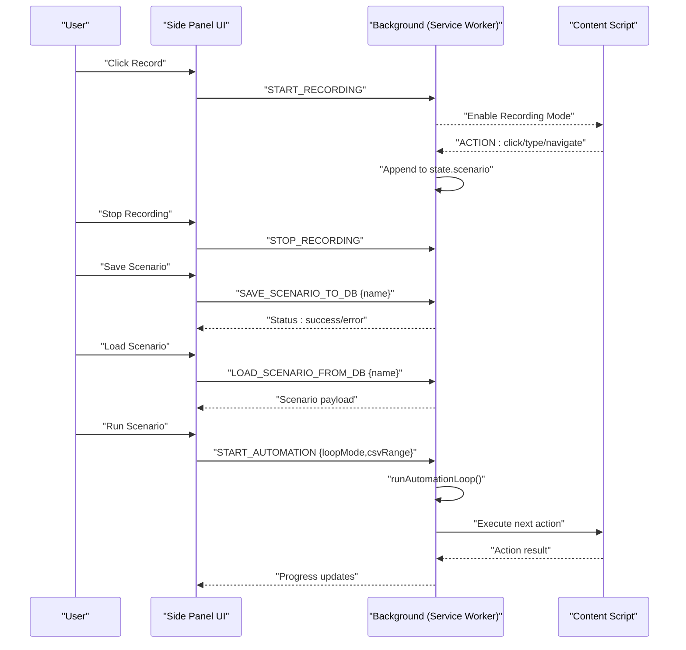
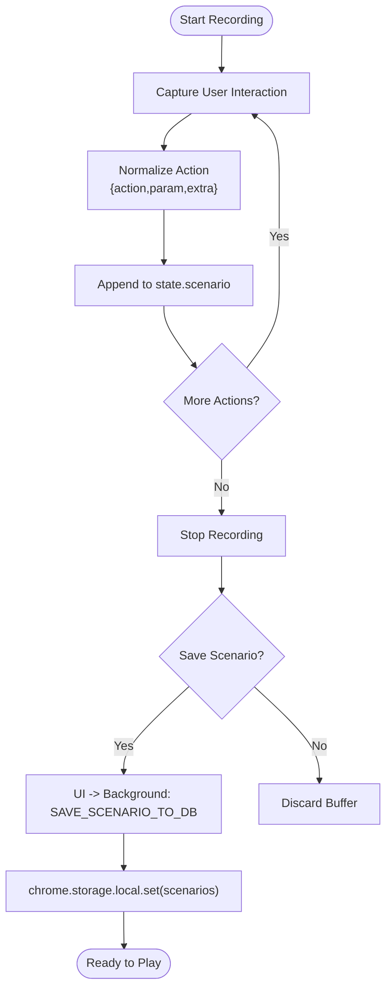
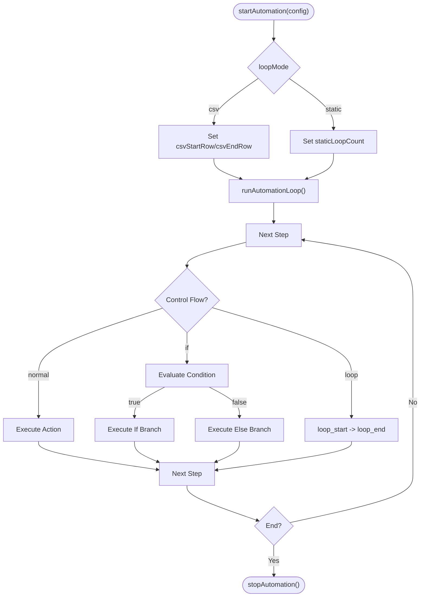
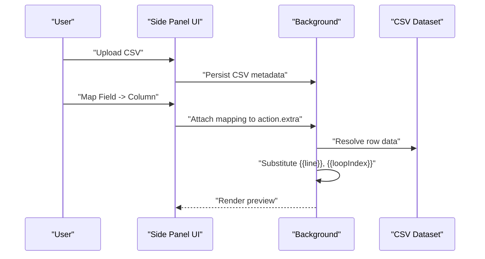
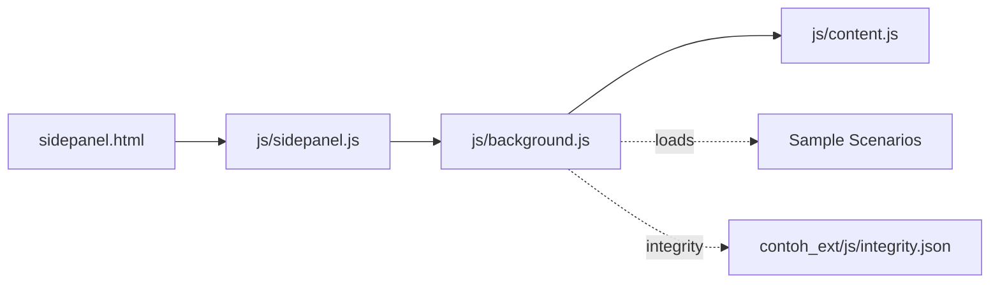

# Scenario Management System

<cite>
**Referenced Files in This Document**
- [README.md](file://README.md)
- [sidepanel.html](file://sidepanel.html)
- [js/background.js](file://js/background.js)
- [js/content.js](file://js/content.js)
- [js/sidepanel.js](file://js/sidepanel.js)
- [contoh_ext/js/integrity.json](file://contoh_ext/js/integrity.json)
- [contoh_ext/sample/index.html](file://contoh_ext/sample/index.html)
- [contoh_ext/sample_scenarios/General/Otomatis_Input_Data_ke_Tabel_Web__DemoQA_.json](file://contoh_ext/sample_scenarios/General/Otomatis_Input_Data_ke_Tabel_Web__DemoQA_.json)
- [contoh_ext/sample_scenarios/General/Isi_Google_Form.json](file://contoh_ext/sample_scenarios/General/Isi_Google_Form.json)
- [contoh_ext/sample_scenarios/General/isi_form_dengan_loop_dataset.json](file://contoh_ext/sample_scenarios/General/isi_form_dengan_loop_dataset.json)
- [contoh_ext/sample_scenarios/General/kombinasi_if_else_loop_while.json](file://contoh_ext/sample_scenarios/General/kombinasi_if_else_loop_while.json)
- [contoh_ext/sample_scenarios/Instagram/Scrolling_List_Follower_Instagram.json](file://contoh_ext/sample_scenarios/Instagram/Scrolling_List_Follower_Instagram.json)
- [contoh_ext/sample_scenarios/Tiktok/tiktok_comment_view.json](file://contoh_ext/sample_scenarios/Tiktok/tiktok_comment_view.json)
- [contoh_ext/sample_scenarios/Tokopedia/Scrape_Tokopedia_Products.json](file://contoh_ext/sample_scenarios/Tokopedia/Scrape_Tokopedia_Products.json)
- [contoh_ext/sample_scenarios/WhatsApp/Deteksi_Pesan_Baru_WA.json](file://contoh_ext/sample_scenarios/WhatsApp/Deteksi_Pesan_Baru_WA.json)
- [contoh_ext/sample_scenarios/Youtube/Alert_Youtube_Comment.json](file://contoh_ext/sample_scenarios/Youtube/Alert_Youtube_Comment.json)
</cite>

## Table of Contents
1. [Introduction](#introduction)
2. [Project Structure](#project-structure)
3. [Core Components](#core-components)
4. [Architecture Overview](#architecture-overview)
5. [Detailed Component Analysis](#detailed-component-analysis)
6. [Dependency Analysis](#dependency-analysis)
7. [Performance Considerations](#performance-considerations)
8. [Troubleshooting Guide](#troubleshooting-guide)
9. [Conclusion](#conclusion)
10. [Appendices](#appendices)

## Introduction
This document explains ExtentionAuto’s scenario management system with a focus on the JSON-based configuration format, scenario creation workflow, validation mechanisms, and execution patterns. It covers general web automation, social media interactions, and e-commerce operations, and documents recording, editing, CSV mapping, conditional logic, loops, ranges, and persistence via browser storage.

## Project Structure
The repository organizes scenario assets under a dedicated samples area and provides the extension runtime under js/. The scenario management UI lives in the side panel, while the background service worker manages state, persistence, and playback orchestration.

**Diagram sources**
- [sidepanel.html](file://sidepanel.html)
- [js/sidepanel.js](file://js/sidepanel.js)
- [js/background.js](file://js/background.js)
- [js/content.js](file://js/content.js)
- [contoh_ext/js/integrity.json](file://contoh_ext/js/integrity.json)

**Section sources**
- [README.md](file://README.md)
- [sidepanel.html](file://sidepanel.html)

## Core Components
- Scenario JSON Schema: Each scenario is a JSON object containing metadata and a steps array of actions. Actions define operation type, parameters, and optional extras for CSV mapping or comments.
- Recording Engine: Content script captures user interactions and appends normalized actions to the active scenario buffer.
- Side Panel Editor: Provides UI to save, load, edit, delete, and play scenarios; supports manual action addition and CSV mapping dropdowns.
- Background Orchestrator: Manages state, persists scenarios to local storage, and executes playback loops with CSV or static modes.
- CSV Data Mapping: Connects form fields to CSV columns for data-driven automation.

Key implementation anchors:
- Scenario persistence and retrieval in background service worker.
- UI wiring for saving/loading/deleting scenarios.
- Playback orchestration and loop/range control.

**Section sources**
- [js/background.js](file://js/background.js)
- [js/sidepanel.js](file://js/sidepanel.js)
- [sidepanel.html](file://sidepanel.html)
- [README.md](file://README.md)

## Architecture Overview
The system uses a service worker (background.js) as the central orchestrator, communicating with the side panel UI and content script. The content script records DOM interactions and sends normalized actions to the background. The background stores scenarios in local storage and coordinates playback.

**Diagram sources**
- [js/background.js](file://js/background.js)
- [js/content.js](file://js/content.js)
- [js/sidepanel.js](file://js/sidepanel.js)

## Detailed Component Analysis

### Scenario JSON Schema and Validation
Each scenario JSON includes:
- name: Human-readable identifier.
- steps: Array of action objects with:
  - action: Operation type (e.g., navigate, click, type, delay, scroll, wait, loop_start, loop_end, if, else, endif).
  - param: Operation-specific parameter (e.g., URL, selector, delay ms, loop count).
  - extra: Optional field for CSV column mapping or comments.

Validation mechanisms observed:
- Presence checks for required keys during load/save.
- Type checks for numeric params (e.g., delay, loop count).
- Existence checks for named scenarios before load/delete.
- UI-level validation for empty scenario names before save.

Example references:
- General web automation with loops and variables.
- Social media and e-commerce scenarios demonstrating diverse action sets.

**Section sources**
- [contoh_ext/sample_scenarios/General/Otomatis_Input_Data_ke_Tabel_Web__DemoQA_.json](file://contoh_ext/sample_scenarios/General/Otomatis_Input_Data_ke_Tabel_Web__DemoQA_.json)
- [contoh_ext/sample_scenarios/General/Isi_Google_Form.json](file://contoh_ext/sample_scenarios/General/Isi_Google_Form.json)
- [contoh_ext/sample_scenarios/General/isi_form_dengan_loop_dataset.json](file://contoh_ext/sample_scenarios/General/isi_form_dengan_loop_dataset.json)
- [contoh_ext/sample_scenarios/General/kombinasi_if_else_loop_while.json](file://contoh_ext/sample_scenarios/General/kombinasi_if_else_loop_while.json)
- [js/background.js](file://js/background.js)

### Scenario Creation Workflow
- Real-time recording captures user actions and appends normalized entries to the active scenario buffer.
- Manual actions can be added via the side panel (navigate, scroll, wait).
- Editing allows updating selectors, values, and CSV mappings per step.
- Saving persists the scenario to local storage keyed by name.
- Loading retrieves and applies a stored scenario to the active buffer.
- Deleting removes a scenario from storage.

**Diagram sources**
- [js/background.js](file://js/background.js)
- [js/sidepanel.js](file://js/sidepanel.js)

**Section sources**
- [js/background.js](file://js/background.js)
- [js/sidepanel.js](file://js/sidepanel.js)
- [sidepanel.html](file://sidepanel.html)

### Playback Orchestration and Loop Controls
Playback mode supports:
- Static loop mode: fixed iteration count.
- CSV loop mode: iterate rows defined by start/end range.
- Range specification: limit execution to a subset of CSV rows.
- Conditional logic: if/else/endif blocks around actions.
- Loop constructs: loop_start/loop_end with counters.

Execution flow:
- Start automation initializes state (mode, indices, ranges).
- runAutomationLoop iterates through steps, resolving CSV variables and applying control flow.
- Smart wait engine ensures readiness before executing actions.

**Diagram sources**
- [js/background.js](file://js/background.js)

**Section sources**
- [js/background.js](file://js/background.js)
- [README.md](file://README.md)

### CSV Data Mapping and Variable Substitution
- CSV upload is supported in the UI.
- Each form action exposes a CSV column mapping dropdown to connect fields to columns.
- Variables like {{line}} and {{loopIndex}} enable dynamic substitution during playback.
- Range controls allow limiting execution to specific rows.

**Diagram sources**
- [README.md](file://README.md)
- [sidepanel.html](file://sidepanel.html)

**Section sources**
- [README.md](file://README.md)
- [sidepanel.html](file://sidepanel.html)

### Scenario Types and Examples
- General Web Automation: navigation, form filling, pagination, scraping, validation.
- Social Media Interactions: scrolling lists, unfollowing, commenting, alerts.
- E-commerce Operations: product scraping, listing monitoring.
- Messaging: new message detection.
- YouTube: comment alerts and playlist monitoring.

Examples from the codebase:
- General: automated table input, Google Form filling, looped dataset submission, nested control flow.
- Instagram: follower list scrolling, form filling with loops.
- TikTok: comment view automation.
- Tokopedia: product scraping.
- WhatsApp: new message detection.
- YouTube: comment alerts and playlist alerts.

**Section sources**
- [contoh_ext/sample_scenarios/General/Otomatis_Input_Data_ke_Tabel_Web__DemoQA_.json](file://contoh_ext/sample_scenarios/General/Otomatis_Input_Data_ke_Tabel_Web__DemoQA_.json)
- [contoh_ext/sample_scenarios/General/Isi_Google_Form.json](file://contoh_ext/sample_scenarios/General/Isi_Google_Form.json)
- [contoh_ext/sample_scenarios/General/isi_form_dengan_loop_dataset.json](file://contoh_ext/sample_scenarios/General/isi_form_dengan_loop_dataset.json)
- [contoh_ext/sample_scenarios/General/kombinasi_if_else_loop_while.json](file://contoh_ext/sample_scenarios/General/kombinasi_if_else_loop_while.json)
- [contoh_ext/sample_scenarios/Instagram/Scrolling_List_Follower_Instagram.json](file://contoh_ext/sample_scenarios/Instagram/Scrolling_List_Follower_Instagram.json)
- [contoh_ext/sample_scenarios/Tiktok/tiktok_comment_view.json](file://contoh_ext/sample_scenarios/Tiktok/tiktok_comment_view.json)
- [contoh_ext/sample_scenarios/Tokopedia/Scrape_Tokopedia_Products.json](file://contoh_ext/sample_scenarios/Tokopedia/Scrape_Tokopedia_Products.json)
- [contoh_ext/sample_scenarios/WhatsApp/Deteksi_Pesan_Baru_WA.json](file://contoh_ext/sample_scenarios/WhatsApp/Deteksi_Pesan_Baru_WA.json)
- [contoh_ext/sample_scenarios/Youtube/Alert_Youtube_Comment.json](file://contoh_ext/sample_scenarios/Youtube/Alert_Youtube_Comment.json)

### Asset Integrity and Guidance
- integrity.json enumerates sample assets to ensure integrity checks.
- sample/index.html provides selector formats, scroll syntax, dropdown selection, and variable usage patterns.

**Section sources**
- [contoh_ext/js/integrity.json](file://contoh_ext/js/integrity.json)
- [contoh_ext/sample/index.html](file://contoh_ext/sample/index.html)

## Dependency Analysis
The side panel UI depends on the background service worker for persistence and playback. The background worker depends on the content script for DOM interaction execution. Sample scenarios depend on the background worker’s schema and playback engine.

**Diagram sources**
- [js/sidepanel.js](file://js/sidepanel.js)
- [js/background.js](file://js/background.js)
- [js/content.js](file://js/content.js)
- [contoh_ext/js/integrity.json](file://contoh_ext/js/integrity.json)

**Section sources**
- [js/sidepanel.js](file://js/sidepanel.js)
- [js/background.js](file://js/background.js)
- [js/content.js](file://js/content.js)

## Performance Considerations
- Smart wait engine avoids hard-coded timeouts, reducing retries and improving robustness on slower networks.
- Loop controls and range specifications minimize unnecessary iterations.
- Efficient CSV row resolution and variable substitution reduce overhead during playback.

[No sources needed since this section provides general guidance]

## Troubleshooting Guide
Common issues and remedies:
- Scenario not found when loading: Verify the scenario name exists in storage; check logs for “not found” messages.
- Save fails due to empty name: Ensure a non-empty name is provided in the side panel input.
- Playback errors: Confirm CSV mapping correctness and that required columns exist; validate loop counts and ranges.
- Recording not capturing actions: Ensure recording mode is active and the content script is injected.

**Section sources**
- [js/background.js](file://js/background.js)
- [js/sidepanel.js](file://js/sidepanel.js)

## Conclusion
ExtentionAuto’s scenario management system combines a robust JSON schema, real-time recording, granular editing, CSV-driven data mapping, and flexible playback controls. The architecture cleanly separates UI, persistence, and execution, enabling reliable automation across general web tasks, social media, and e-commerce contexts.

[No sources needed since this section summarizes without analyzing specific files]

## Appendices

### Example Scenario Structures (by category)
- General Web Automation
  - Automated table input with loops and variables.
  - Google Form filling with dataset-driven submissions.
  - Nested control flow combining if/else and loops.
- Social Media Interactions
  - Instagram follower list scrolling.
  - TikTok comment view automation.
  - YouTube comment alerts and playlist monitoring.
- E-commerce Operations
  - Tokopedia product scraping.
- Messaging
  - WhatsApp new message detection.

**Section sources**
- [contoh_ext/sample_scenarios/General/Otomatis_Input_Data_ke_Tabel_Web__DemoQA_.json](file://contoh_ext/sample_scenarios/General/Otomatis_Input_Data_ke_Tabel_Web__DemoQA_.json)
- [contoh_ext/sample_scenarios/General/Isi_Google_Form.json](file://contoh_ext/sample_scenarios/General/Isi_Google_Form.json)
- [contoh_ext/sample_scenarios/General/isi_form_dengan_loop_dataset.json](file://contoh_ext/sample_scenarios/General/isi_form_dengan_loop_dataset.json)
- [contoh_ext/sample_scenarios/General/kombinasi_if_else_loop_while.json](file://contoh_ext/sample_scenarios/General/kombinasi_if_else_loop_while.json)
- [contoh_ext/sample_scenarios/Instagram/Scrolling_List_Follower_Instagram.json](file://contoh_ext/sample_scenarios/Instagram/Scrolling_List_Follower_Instagram.json)
- [contoh_ext/sample_scenarios/Tiktok/tiktok_comment_view.json](file://contoh_ext/sample_scenarios/Tiktok/tiktok_comment_view.json)
- [contoh_ext/sample_scenarios/Tokopedia/Scrape_Tokopedia_Products.json](file://contoh_ext/sample_scenarios/Tokopedia/Scrape_Tokopedia_Products.json)
- [contoh_ext/sample_scenarios/WhatsApp/Deteksi_Pesan_Baru_WA.json](file://contoh_ext/sample_scenarios/WhatsApp/Deteksi_Pesan_Baru_WA.json)
- [contoh_ext/sample_scenarios/Youtube/Alert_Youtube_Comment.json](file://contoh_ext/sample_scenarios/Youtube/Alert_Youtube_Comment.json)